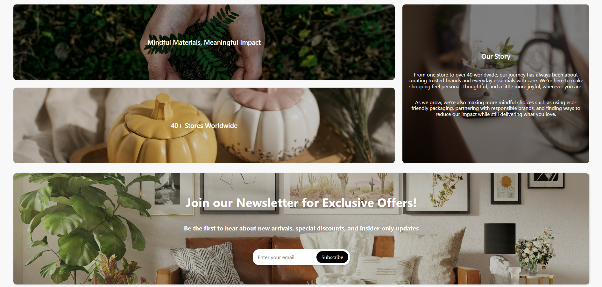
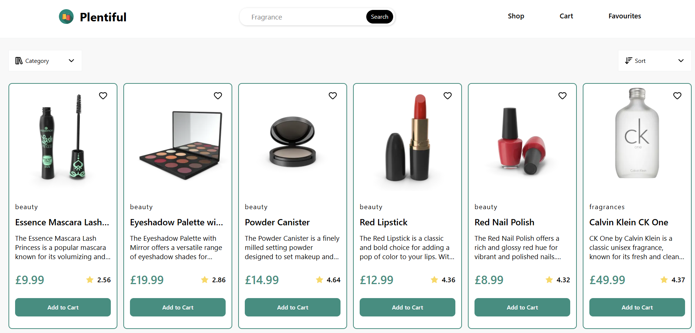
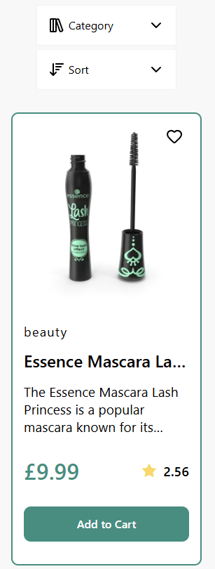

# Plentiful

## Introduction
A mock shopping website built with React and DummyJSON API. 

It includes category filtering, sorting, pagination and UI skeletons. Users can browse products, refine their search, add items to favourites or cart, and simulate a purchase.

The website is fully responsive and works across desktop, tablet and mobile devices.

## Features
* __Multi-Page Navigation__: Includes pages for Home, Shop, Cart and more.
* __Favourites__: Save products to a favourites list.
* __Responsive Design__: Works across desktop, tablet and mobile devices.
* __UI Skeletons__: Provide clean loading states while data is fetched.
* __Search Functionality__: Quickly find products by name.
* __Category Filtering__: Choose which product categories to display.
* __Sorting Options__: Sort products by price, rating, or alphabetically.
* __Pagination__: Load more products as you browse.

## Technologies Used
* React
* Vite
* React Router
* React Loading Skeleton
* Lucide (for icons)
* DummyJSON (for products)

## Project Link
You can view this project [here](https://alexs1302-plentiful.vercel.app/)!

## Project Interface (Screenshots)
### Desktop View
#### Home Page

#### Shop Page

### Mobile View
#### Home Page

#### Shop Page

## Credits
See [CREDITS.md](CREDITS.md) for full image attributions.

This project was created as part of The Odin Project's curriculum, a free online resource for learning web development.
